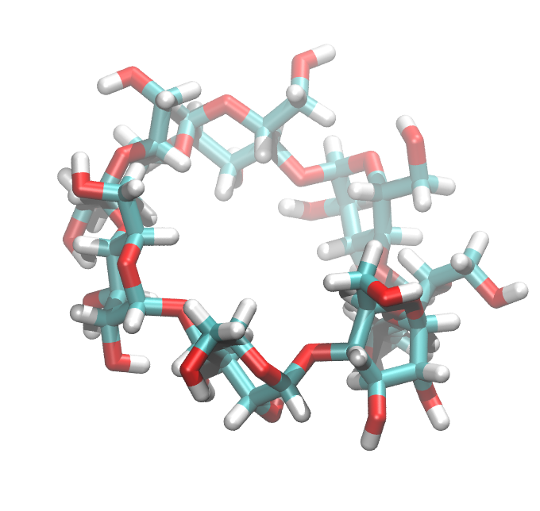
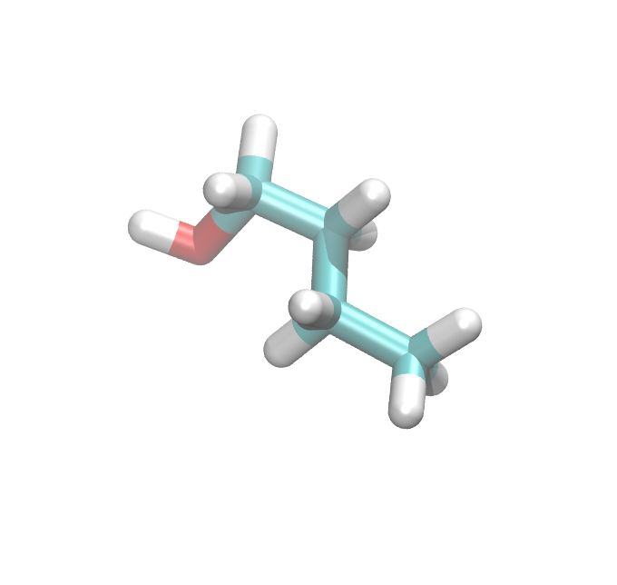
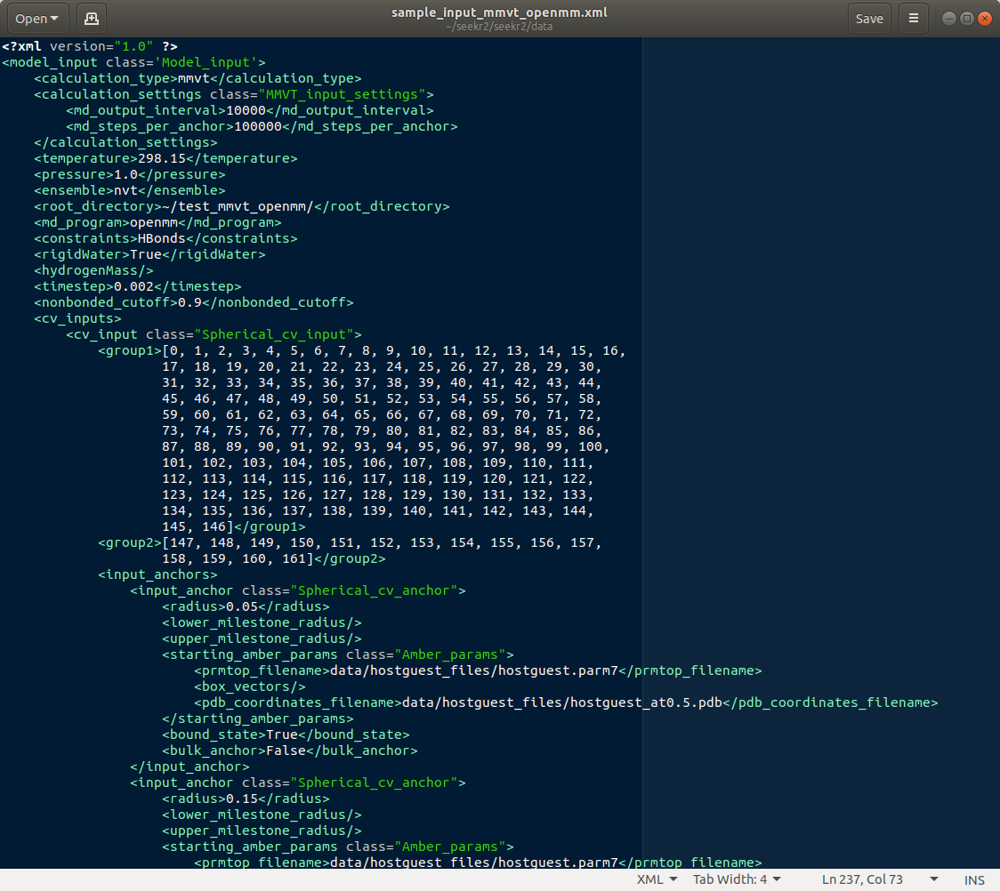
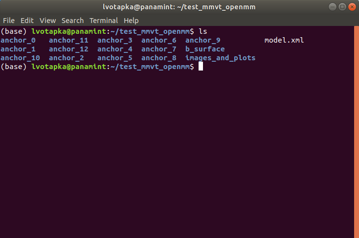
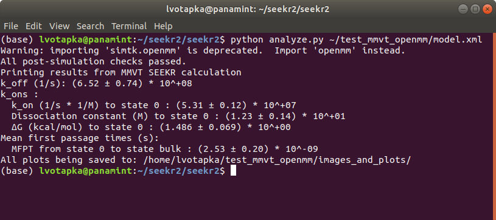
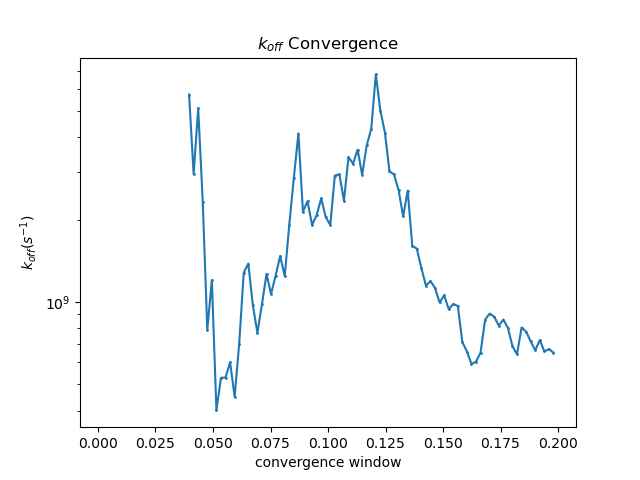
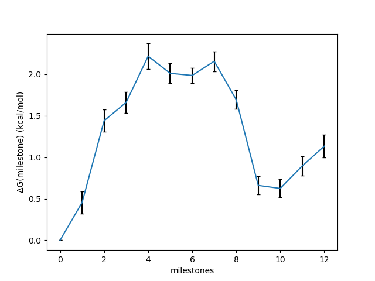

SEEKR2 Tutorial
===============

Follow these tutorials to learn how to use SEEKR2.

1. Host-guest calculation - learn the basics of SEEKR2 on a simple system.
2. Trypsin-benzamidine calculation - Try SEEKR2 on a real protein-ligand system.

It is assumed that you have completed the installation and tests outlined in the
:doc:`Installation<installation>` documentation.

Tutorial 1: Host-guest calculation
----------------------------------

In this tutorial, we will be performing a sample SEEKR2 calculation to determine
the kinetics of binding between beta-cyclodextrin (the "host") and the small
molecule 1-butanol (the "guest").

   
   The beta-cyclodextrin "host" molecule

   
   The 1-butanol "guest" molecule

Navigate to the location where the seekr2/ Git repository was cloned, and enter
the repository's program directory and view the available programs::

  cd seekr2/seekr2
  ls

You should see a number of python programs, as well as a few directories. The
first program we will be using is the "prepare.py" script.

The prepare.py script requires a "model input" file, which is in XML format.
Using Gedit, Vim, or another editor, open up the file 
"data/sample_input_mmvt_openmm.xml", which is a sample model input file.

   
   Model input file of the host-guest system.

There is a lot of information in here, the details of which are described in
the :doc:`Model Input Files<model_input_files>` documentation. For this 
tutorial, we will be using this file as-is, for now.

There are other provided files we need for this SEEKR2 calculation, they are 
described here:

* **data/hostguest_files/hostguest.parm7** - The AMBER parameter/topology file 
  which contains parameters for the host and guest molecules, as well as the
  water molecules comprising the waterbox.
  
* **data/hostguest_files/hostguest_at###.pdb** - Each of these files describe 
  the starting atomic coordinates and box vectors for each of the anchors in the
  MD stage. These PDB files were made using an SMD simulation, where the "guest"
  was pulled slowly away from the bound state, and the structures were saved
  as the guest molecule reached each of the anchor locations.
  
* **hostguest_receptor.pqr** - The host molecule (beta-cyclodextrin) for
  Browndye input in PQR format.
   
* **hostguest_ligand.pqr** - The guest molecule (1-butanol) for
  Browndye input in PQR format.
   
If you want to use SEEKR2 on a system of your own choosing, you will need to
generate similar input files for it.

Next, run prepare.py on the model input file::

  python prepare.py data/sample_input_mmvt_openmm.xml

For a few minutes, the script will construct a directory and file tree located
at "~/test_mmvt_openmm/". The program may throw a few warnings, but these can 
usually be safely ignored, as long as there are no errors or check failures.

When the command is complete, enter the new directory and see what is there::

  cd ~/test_mmvt_openmm/
  ls

You'll see a number of directories starting with "anchor", as well as a 
"b_surface" and "BD_milestone" directory. Let's talk about each of these
files/directories. (Consider viewing the contents of the files and directories
as we talk about them).

   
   The files and directories of a SEEKR2 calculation.

* **model.xml** - This is arguably the most important file. It contains most of
  the high-level information used by later SEEKR2 stages.
  
* **anchor_0/, anchor_1/, etc...** - These directories contain the MD 
  simulation information in two directories:
  
   * **building/** - This directory contains the parameter/topology and starting 
     structure files for the MD simulations.
      
   * **prod/** - This directory will contain the "production" data generated by the
     MD simulation, including trajectory data, restart checkpoint files, and, 
     most importantly, the "bounce" information needed for the MMVT analysis to
     extract transition probabilities and times.

* **b_surface** - This directory contains the input files for BD simulations
  starting from the b-surface and either escaping or ending at the BD milestone.
  
* **bd_milestone_0** - This directory will contain BD simulation files starting
  from the BD surface and either escaping or ending at the milestone beneath
  the BD milestone. For now, there are only a couple of empty directories 
  inside here, since the starting structure and parameters must be extracted
  from the b-surface simulations once they are completed.

The preparation stage is complete. Next, we complete the run stage.

Navigate to the location where the seekr2/ Git repository was cloned, and enter
the repository's program directory and view the available programs again::

  cd seekr2/seekr2
  ls
  
This time, we will use the run.py program, and we will use the new model.xml
file as the INPUT FILE argument::

  python run.py any ~/test_mmvt_openmm/model.xml

The keyword "any" is an INSTRUCTION argument which indicates that SEEKR2 
should run any unfinished MD or BD calculations. 

Note that SEEKR2 periodically creates checkpoints, so if your calculation 
is ever interrupted, the run.py program can just pick right up where it left 
off as long as the INSTRUCTION covers the calculation that was interrupted.
This can be very useful if running SEEKR2 on a supercomputer with a queue for
jobs that run only a limited time.

Since this is the first time you're running this calculation, there are no
simulations yet complete, so SEEKR2 will run all the needed MD and BD 
simulations. This is likely to take an hour or two if you have a relatively 
fast GPU running OpenMM. (Warning: Without a GPU, this calculation will probably 
take a prohibitively long time).

Once complete, we are finished with the run stage. We can check the progress of
our simulations with the converge.py program::

  python converge.py ~/test_mmvt_openmm/model.xml
  
The output will show how many transitions were observed for the various MD and
BD simulations. One can also see additional convergence information.

Next, let us perform the analysis stage. Return to the SEEKR2 program
directory::

  cd seekr2/seekr2
  ls

To analyze our results, we use the analyze.py program::

  python analyze.py ~/test_mmvt_openmm/model.xml
  
After a few minutes, the script should display kinetic and thermodynamic 
results:

   
   The script analyze.py outputs the kinetics and thermodynamics of binding.
   
in addition, we may look at some generated images and plots::

  cd ~/test_mmvt_openmm
  cd images_and_plots
  
Now use EOG or another visualization program to view the k-off convergence 
image::

  eog k_off_convergence.png
  

   
   Convergence plots can give hints about whether more sampling is needed.

Next, take a look at the free energy profile (potential of mean force)::

  eog free_energy_profile.png
  

   
   The free energy profile (or potential of mean force).

*NOTE: all of these results were generated using far too little sampling for a
true SEEKR2 calculation, and simulations were cut very short here for 
demonstration purposes, so that a SEEKR2 calculation could be completed within
the span of a couple of hours on a desktop computer with a GPU. The results 
generated in this tutorial should not be taken seriously.*

Congratulations! If you've made it to this point successfully, you've completed
a SEEKR2 calculation.

Tutorial 2: Trypsin-benzamidine calculation
-------------------------------------------

Tutorial coming soon.