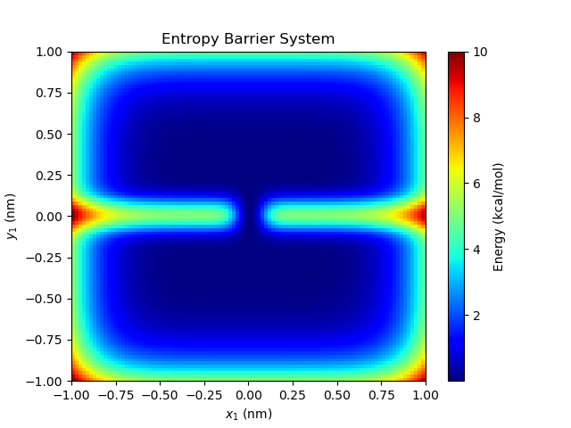
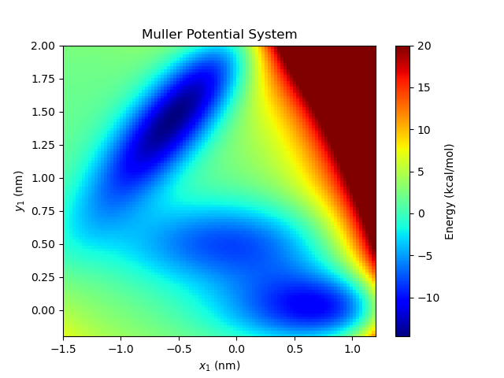
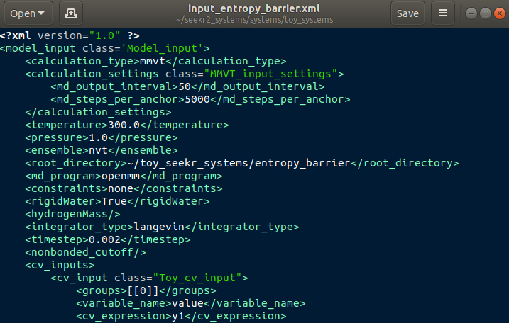

Tutorial 2: Toy Systems
=======================

In this tutorial, we will be performing a SEEKR2 calculation on a "Toy System",
that is - a system with one or few particle(s) that move on a relatively simple
potential energy surface.

Toy systems can be very useful to benchmark the accuracy of a new method,
to improve conception understanding of the interaction between a method and
a real molecular system, or as a teaching tool about the method.

In this tutorial, we will be using the Entropy Barrier and Muller Potential
toy systems.

   
   The Entropy Barrier toy system

   
   The Muller Potential toy system
   
First, to prepare and run the toy systems, it will be helpful to have a
sample input XML.

Move to your home directory or other convenient location and clone the 
seekr2_systems repository.::

  cd
  git clone https://github.com/seekrcentral/seekr2_systems.git

A number of useful input files can be found in this repository, but we are
going to use the input files in the seekr2_systems/systems/toy_systems/
directory. Let's start by looking at the Entropy Barrier system input.::

  cd seekr2_systems/systems/toy_systems
  
Using Gedit, Vim, or another editor, open up the file 
"input_entropy_barrier.xml".

   
   Model input file of the Entropy Barrier toy system.

As with the host/guest system, this input file contains all the information
to prepare a SEEKR calculation. Detailed information for all inputs can be
found in :doc:`Model Input Files<model_input_files>` and some should be
familiar from :doc:`Tutorial 1<tutorial1_hostguest>`, but I'm going to 
highlight a few key changes unique to toy systems.

First, toy systems require their own kind of collective variable (CV).
Notice that the CV is of a "Toy_cv_input" type, and its anchors are of the
"Toy_cv_anchor" type. Notice that, for a toy system, none of the input
require any files except the MOdel Input File, which is an advantage to running
toy systems.

<groups>
  The value "[[0]]" is a Python list of a list, both of length 1, and this 
  entry indicates that this CV only keeps track of a single group, formed of
  a single atom, and that's atom index 0. Toy systems can have any number of
  atoms, and Toy CVs can keep track of any of those atoms as needed.